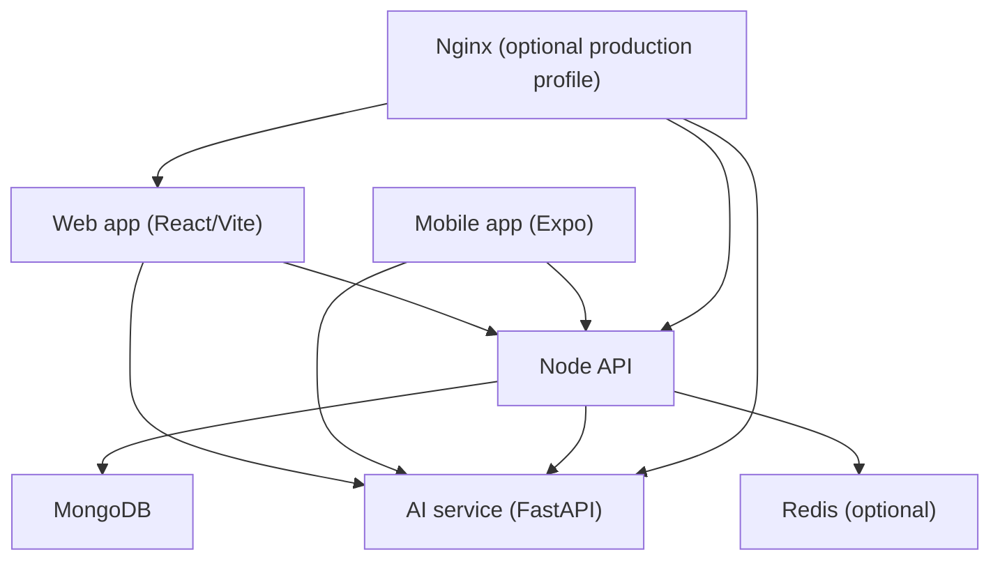
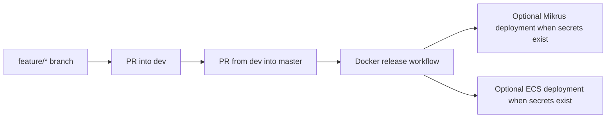
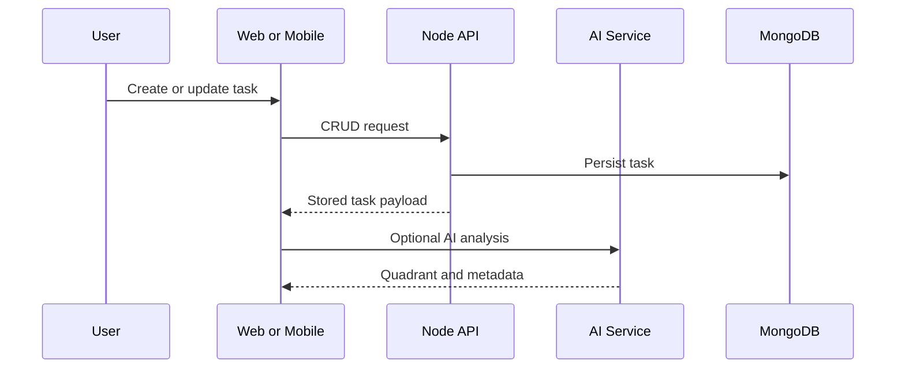

# Eisenhower Matrix Infrastructure

Last updated: 2026-03-09

This document describes the current infrastructure and delivery model of the Eisenhower Matrix monorepo. It favors the state that is implemented in the repository today over aspirational architecture.

## System Overview

| Component | Stack | Purpose |
| --- | --- | --- |
| `web` | React 18, TypeScript, Vite, Tailwind | Browser UI for task management and AI tools |
| `backend-node` | Node.js, Express, TypeScript, MongoDB | Task API and health endpoints |
| `backend-ai` | Python 3.11, FastAPI, PyTorch, MiniLM | Local task classification, OCR endpoints, training data management |
| `mobile/eisenhower-matrix` | Expo, React Native, Expo Image Picker | Mobile client with local cache, task API sync, and AI-assisted flows |
| `docker-compose.yml` | Docker Compose | Local multi-service stack |
| `.github/workflows/*.yml` | GitHub Actions | CI, branch policy, and release automation |

## Repository Topology

```text
web/                        Frontend application
backend-node/               Node/Express API
backend-ai/                 FastAPI AI service
mobile/eisenhower-matrix/   Expo mobile client
monitoring/                 Prometheus and Grafana assets
docker-compose.yml          Local service orchestration
.github/workflows/          Branch policy, CI, and release workflows
```

## Runtime Architecture



### Core request paths

- Web task CRUD flows call `backend-node`.
- Web AI tooling and the mobile client call `backend-ai`.
- The mobile client reads and mutates tasks through `backend-node` when the API is reachable, while keeping AsyncStorage as a local cache.
- `backend-node` persists tasks in MongoDB.
- Redis, Nginx, Prometheus, and Grafana are available in Docker Compose as optional infrastructure layers.

## Local Docker Stack

The repository ships a root `docker-compose.yml` with the following services:

- `frontend`
- `api-service`
- `ai-service`
- `mongodb`
- `redis`
- `nginx` using the `production` profile
- `prometheus` and `grafana` using the `monitoring` profile

Example commands:

```bash
docker compose up --build
docker compose --profile monitoring up --build
docker compose --profile production up --build
```

## Service Boundaries

### Web

- Uses `VITE_API_URL` for task CRUD.
- Uses `VITE_AI_API_URL` for AI-specific requests.
- Production container injects these values at runtime via `/runtime-config.js`.
- Production can route both values through same-origin reverse proxy paths such as `/api` and `/ai` to avoid mixed-content and CORS issues.
- Includes lazy-loaded AI and 3D modules to keep the main bundle smaller.

### Backend Node

- Exported through an app factory, so tests can import the Express app without starting a server.
- Exposes `GET /health`, `GET /tasks`, `POST /tasks`, `PUT /tasks/:id`, and `DELETE /tasks/:id`.
- Uses MongoDB as the primary datastore.

### Backend AI

- Exported through `create_app()` to keep imports side-effect free.
- Supports local MiniLM-based task classification, deterministic advanced analysis, OCR upload handling, training-data endpoints, and persisted provider toggles for `local_model` and `tesseract`.
- Boots from a cached local classifier artifact or trains one from the current training data on first start.
- Keeps the local model injectable so tests can replace it with lightweight fakes.

### Mobile

- Expo-managed package with Jest and React Native Testing Library coverage gates.
- Stores a local task cache with AsyncStorage.
- Uses `EXPO_PUBLIC_API_URL` for task CRUD sync and `EXPO_PUBLIC_AI_API_URL` for AI and OCR requests.
- Uses `expo-image-picker` to select images for OCR uploads.

## Configuration Matrix

| Area | Variable | Purpose |
| --- | --- | --- |
| Web | `VITE_API_URL` | Node API base URL |
| Web | `VITE_AI_API_URL` | AI service base URL |
| Backend Node | `PORT` | HTTP port for the API service |
| Backend Node | `MONGODB_URI` | MongoDB connection string |
| Backend Node | `AI_SERVICE_URL` | AI service base URL |
| Backend Node | `JWT_SECRET` | Required outside tests |
| Backend AI | `TRAINING_DATA_PATH` | Training examples path |
| Backend AI | `MODEL_CACHE_DIR` | Cache and model artifacts |
| Backend AI | `LOCAL_MODEL_NAME` | Frozen sentence-transformer encoder |
| Backend AI | `LOCAL_MODEL_EPOCHS` | Max epochs for explicit retraining |
| Mobile | `EXPO_PUBLIC_AI_API_URL` | AI service base URL for Expo |
| Mobile | `EXPO_PUBLIC_API_URL` | Node API base URL for Expo |

## CI and Branch Governance

The repository uses three workflows:

- `branch-policy.yml`
  Ensures only `dev` can open pull requests into `master`.
- `ci.yml`
  Runs `security-lint`, `test-backend-node`, `test-frontend`, `test-backend-ai`, and `test-mobile` on `dev` and `master`.
- `release.yml`
  Builds Docker images on pushes to `master` and performs optional deployments when required secrets are present (`deploy-mikrus` and ECS).

Protected branches:

- `dev`
- `master`

Ruleset expectations:

- no direct pushes
- no force pushes
- no branch deletion
- pull requests required
- resolved conversations required
- branch must be up to date before merge

## Security Baseline

Current repository-level controls include:

- protected branch flow through `feature/* -> dev -> master`
- mandatory CI checks on protected branches
- Trivy SARIF upload in CI
- Node API runtime config with explicit `JWT_SECRET` outside tests
- service-specific coverage thresholds, with `100%` on web/backends and `95/90` gates on mobile

Recommended production additions that are not fully implemented in this repository:

- centralized secret storage
- managed TLS termination
- external log aggregation
- explicit backup and restore procedures for MongoDB

## Delivery Model



## Data Flow



## Notes

- If the runtime contract changes, update this document together with the relevant service README or configuration file.
