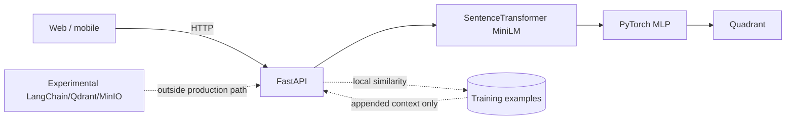
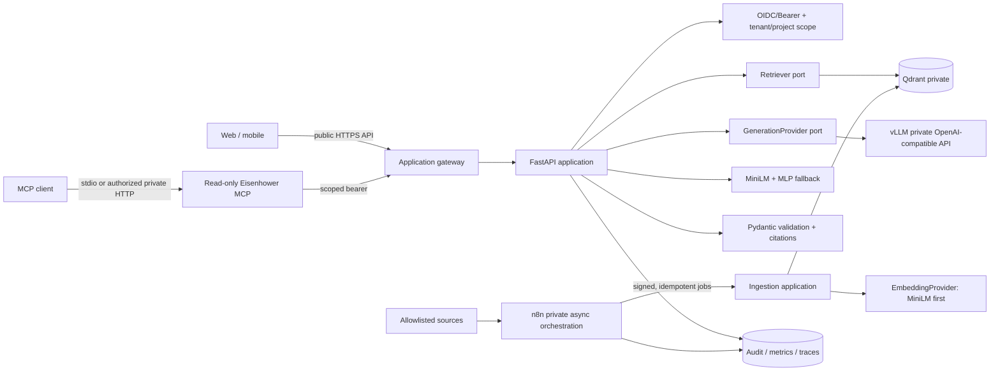

# AI rebuild: architecture and delivery record

Status: local implementation and planning record. Nothing in this directory proves deployment, production readiness, a running Qdrant/n8n/vLLM stack, or usable GPU capacity.

## Evidence labels

- **Implemented locally** means code or configuration exists in this worktree. It still needs the test and runtime gates listed below.
- **Verified locally** means a specific check has been run against this worktree; verification results belong in the delivery report, not inferred from source files.
- **Runtime unknown** means the dependency, model, data source, target network, or hardware was not exercised.
- **Target** means an accepted architectural direction, not an already completed feature.
- **Production gate** means evidence required before rollout.

## Canonical domain language

The only accepted quadrant mapping is:

| ID | Urgent | Important | English | Polish |
| --- | --- | --- | --- | --- |
| 0 | yes | yes | Do Now | Zrób teraz |
| 1 | yes | no | Delegate | Deleguj |
| 2 | no | yes | Schedule | Zaplanuj |
| 3 | no | no | Delete | Usuń |

Any corpus export, evaluation set, API response, UI label, or MCP result that swaps 1 and 2 is invalid and must block indexing.

## Current state

The confirmed baseline before this rebuild was a synchronous FastAPI classifier using MiniLM embeddings and a PyTorch MLP. Locally retrieved similar examples were attached to responses but were not grounded generation. Legacy names such as `use_rag`, `/analyze-langchain`, `rag_classification`, and `langchain_analysis` did not prove LangChain or RAG.



## Target state



FastAPI owns online authorization, ACL filters, retrieval, optional later reranking, prompt construction, structured validation, citations, and fallback. n8n never participates in `/v2/ai/analyze`. Web and mobile never call Qdrant, vLLM, or n8n directly.

## Local implementation inventory

| Capability | State in this worktree | Important limit |
| --- | --- | --- |
| Canonical quadrant mapping | Implemented locally in backend/client/MCP changes | Cross-client and migration tests remain the acceptance evidence |
| `POST /v2/ai/analyze` and `POST /v2/knowledge/search` | Implemented locally | No deployed public API is claimed |
| Bearer auth, static dev verifier, OIDC verifier | Implemented and wired locally | IdP integration and production token lifecycle are unverified |
| Retrieval-first RAG ports and application service | Implemented locally with independent retrieval/generation flags and aggregate shadow retrieval | Live Qdrant/shadow traffic remains unverified; user responses stay on fallback unless the response gate is explicitly enabled |
| Qdrant retriever and ingestion adapter | Implemented locally with fail-closed per-document replacement | Canonical document transactions, reconciliation, backup/restore and live isolation remain unverified |
| vLLM generation adapter and circuit breaker | Implemented locally with typed provider failures | Target model/GPU/VRAM and live contract are unknown |
| Immutable PromptSpec, PL/EN registry, token-aware renderer and structured schema | Implemented locally as candidate artifacts | Model/tokenizer/chat-template selection is fail-closed; no champion exists |
| Offline prompt evaluation and regression policy | Implemented locally | Live selected-model run, shadow/canary and rollback automation remain unverified |
| Deterministic chunking and version metadata | Implemented locally | Source-specific normalization and canonical document store remain incomplete |
| Signed n8n webhook verification and replay protection | Implemented and wired locally at `/internal/webhooks/n8n/verify` | Uses a private service token and SQLite replay state; no deployed ingress is claimed |
| Durable idempotent SQLite command queue and worker | Implemented locally with leases, crash reclaim, bounded retry/jitter, dead-letter, allowlisted handlers and monotonic per-document source sequences; Compose `rag` profile includes the consumer | Not activated; SQLite remains a single-consumer topology and project reindex still needs a chosen source connector |
| n8n workflow JSON and schema | Importable local workflow artifacts | Workflows, credentials, gateway and error destination are not imported or activated |
| Per-principal AI rate limit and hashed request audit events | Implemented locally | In-memory limiter is not distributed; no production audit sink/retention is verified |
| Six read-only MCP tools | Implemented locally | MCP SDK/runtime and upstream endpoint compatibility must be verified |
| Metrics, traces, dashboards and SLO alerting | Target | Existing generic monitoring services do not prove AI telemetry |

The local control sequence now matches the rollout plan: Qdrant retrieval can start without any
vLLM model or credential, `/v2/knowledge/search` uses that retrieval-only service, and
`/v2/ai/analyze` can exercise retrieval in shadow while returning the unchanged MiniLM fallback.
An explicitly requested `project_id` is included in the server-side Qdrant filter after API scope
validation. These are source-level capabilities, not evidence of a running corpus or deployment.

## HTTP response contract

`POST /v2/ai/analyze` accepts a strict body:

```json
{"task":"Prepare the incident review before 15:00","language":"en"}
```

The response is validated and makes its mode explicit:

```json
{
  "mode": "rag",
  "quadrant": 0,
  "quadrant_name": "Do Now",
  "confidence": 0.88,
  "explanation": "The deadline and incident impact make the task urgent and important.",
  "citations": [
    {
      "chunk_id": "sha256:...",
      "document_id": "project-17-runbook",
      "source_uri": "eisenhower://projects/17/runbooks/incident",
      "title": "Incident procedure",
      "excerpt": "...",
      "score": 0.82,
      "content_version": "2026-08-09T12:00:00Z"
    }
  ],
  "retrieval": {"hit_count": 3, "top_score": 0.82, "embedding_version": "minilm-v1"},
  "generation": {
    "execution_id": "sha256-without-prefix",
    "prompt_id": "eisenhower-classifier",
    "prompt_version": "1.0.0",
    "model_id": "selected-model",
    "model_revision": "pinned-revision",
    "schema_version": "1.0.0",
    "language": "en",
    "input_tokens": 1240
  },
  "fallback_reason": null
}
```

Every cited ID must be among the retrieved chunks for that request. Missing hits, unavailable generation, malformed structured output, or invalid citations switch to `mode=fallback`; the service must not disguise an ungrounded answer as RAG. `mode=no_answer` is reserved for policies where returning a classifier fallback would be unsafe or misleading.

## Documents in this set

- [Architecture decisions](adr/README.md)
- [Corpus, ACL and reindex contract](corpus-contract.md)
- [First RAG corpus owner decision packet](corpus-owner-decision-packet.md)
- [Approved first-corpus manifest](corpus-manifest-v1.json)
- [Independent TASK-013 review worksheet](../../backend-ai/evaluation/retrieval-v1/HUMAN_REVIEW_WORKSHEET.md)
- [TASK-014 retrieval shadow decision packet](shadow-pilot-decision-packet.md)
- [TASK-015 private vLLM decision packet](vllm-owner-decision-packet.md)
- [Consent-governed memory policy](memory-policy-v1.json)
- [Security review](security-review.md)
- [Operations, observability and rollout](operations.md)
- [Testing and evaluation](testing-evaluation.md)
- [Prompt engineering, versioning and evaluation](prompt-engineering.md)
- [DDD, hexagonal, TDD and BDD assessment](methodology-assessment.md)
- [Phases, gates and smallest vertical slice](delivery-roadmap.md)
- [Recruiter-aligned AI delivery plan](recruitment-readiness.md)
- [Evidence-led private case-study draft](case-study-draft.md)

## Authoritative external references

- [Qdrant collections and aliases](https://qdrant.tech/documentation/manage-data/collections/)
- [Qdrant payload indexes and filtering](https://qdrant.tech/documentation/manage-data/indexing/)
- [vLLM OpenAI-compatible server](https://docs.vllm.ai/en/latest/serving/online_serving/openai_compatible_server/)
- [vLLM structured outputs](https://docs.vllm.ai/en/stable/features/structured_outputs/)
- [vLLM metrics](https://docs.vllm.ai/en/latest/usage/metrics/)
- [vLLM engine arguments](https://docs.vllm.ai/en/stable/configuration/engine_args/)
- [n8n queue mode](https://docs.n8n.io/hosting/scaling/queue-mode/)
- [n8n Webhook node](https://docs.n8n.io/integrations/builtin/core-nodes/n8n-nodes-base.webhook/)
- [MCP server construction](https://modelcontextprotocol.io/docs/develop/build-server)
- [MCP authorization](https://modelcontextprotocol.io/specification/latest/basic/authorization)
- [MCP 2026-07-28 specification release announcement](https://blog.modelcontextprotocol.io/posts/2026-07-28/)
