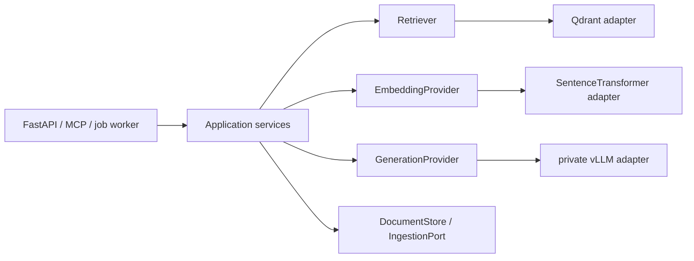

# ADR 0007: Framework AI pozostaje poza rdzeniem; wybieramy mały pipeline Python

- Status: Accepted
- Data decyzji: 2026-08-10
- Zakres: online RAG, zależności AI, oficjalny MCP Python SDK

## Kontekst potwierdzony w repo

`app/rag` ma własne modele Pydantic oraz porty `Retriever`,
`EmbeddingProvider`, `GenerationProvider`, `DocumentStore` i `IngestionPort`.
`RagAnalysisService` posiada reguły fallbacku i walidację cytowań, a bezpośrednie
adaptery obsługują Qdrant, SentenceTransformer i prywatne API vLLM. Produkcyjne
requirements nie instalują Haystack, LlamaIndex ani LangGraph. LangChain jest
wydzielonym legacy/eksperymentem i nie jest implementacją kanonicznego RAG.

To są porty i adaptery w architekturze warstwowej/hexagonalnej w zalążku. Nie
stanowią dowodu pełnego DDD ani CQRS.

## Korekta wersyjna

Pierwotna hipoteza dotyczyła Haystack 2. W dniu decyzji aktualną stabilną linią
jest `haystack-ai==3.0.0`; `2.31.0` jest ostatnim wydaniem 2.x i nie jest już
aktywnie utrzymywane. Spike wykonano więc na 3.0.0, z
`qdrant-haystack==10.5.0`. Nie będziemy rozpoczynać nowej integracji na 2.x.

Haystack 3 scala sync/async w klasie `Pipeline`; `connect()` waliduje topologię
i typy socketów, ale nie zastępuje walidacji Pydantic, ACL ani reguł domenowych.
[Pipeline 3.0](https://docs.haystack.deepset.ai/docs/pipelines),
[Pipeline API](https://docs.haystack.deepset.ai/reference/pipeline-api).

## Decyzja

Kanoniczny online RAG pozostaje małym pipeline'em Python opartym o obecne porty.
Nie dodajemy Haystack do obrazu produkcyjnego. Haystackowy kod spike'a pozostaje
wyłącznie odtwarzalnym artefaktem badawczym w
`backend-ai/spikes/haystack_comparison`.

Powód rozstrzygający: kandydat zachował kontrakty, ale nie zredukował kodu
orkiestracyjnego o wymagane 20% i nie dostarczył funkcji potrzebnej w obecnym,
deterministycznym przepływie retrieval -> generation -> validation/fallback.
Adapter dodał 99 linii do istniejącego serwisu (132 linie łącznie z `search`),
nowy graph lifecycle i 175 MiB zależności w izolowanym venv. Framework nie
uzyskał więc prawa wejścia do runtime'u.

Granica pozostaje:

Typy frameworków, wyjątki, konfiguracja pipeline'u i komponentowe słowniki nie
mogą pojawiać się w HTTP, MCP, jobs, audit logu, payloadach Qdrant ani modelach
aplikacyjnych.

## Wynik spike'a

Środowisko było tymczasowym venv na Pythonie 3.12.3. Nie zmieniono obrazu
produkcyjnego i nie użyto usług wdrożonych.

| Oś | Wynik lokalny | Ocena |
| --- | --- | --- |
| Te same modele i porty | 4/4 testy: identyczny `AnalyzeResult`, zachowany tenant/project/ACL, fallback przy obcej cytacji i jawna różnica schematów Qdrant | pass |
| Wycieki typów | wynik wraca jako `app.rag.models.AnalyzeResult`; Haystack występuje tylko w spike'u | pass |
| LOC | 99 linii adaptera zamiast redukcji istniejącego serwisu | fail |
| Koszt zależności | czysty venv 16 MiB; Haystack 3 + Qdrant integration 191 MiB, czyli +175 MiB i 98 katalogów top-level | mieści się w limicie 300 MB, lecz bez wartości kompensującej |
| Cold import | 0,25-0,31 s w pięciu procesach na lokalnym CPU | pass dla progu +2 s; nie jest pomiarem docelowego kontenera |
| Orkiestracja bez I/O | 1000 iteracji po rozgrzewce: Python p95 0,0098 ms, Haystack p95 0,1647 ms; build 0,0156 vs 0,4797 ms | Haystack wolniejszy; syntetyczne, nie wolno ekstrapolować do p95 usługi |
| CVE | `pip-audit` nie wskazał podatności w runtime dependencies; wskazał jedynie stary `pip` z bazowego venv | pass warunkowy; CI/container scan nadal wymagany |
| Licencje głównych paczek | Apache-2.0, MIT, BSD; NumPy ma złożone notices | pass warunkowy; pełny notices/SBOM nadal wymagany |
| Live Qdrant/vLLM/model/GPU | nie było docelowych usług, modelu ani GPU | unverified; to nie jest wdrożenie ani benchmark produkcyjny |

Surowy benchmark jest odtwarzalny przez `benchmark.py`. Jego fake I/O służy
wyłącznie porównaniu kosztu orkiestracji. Recall@k, MRR, groundedness, poprawność
cytowań, warm service p95, throughput, RSS/VRAM oraz zgodność structured output
z konkretnym modelem pozostają bramkami całego RAG, a nie powodem do instalacji
frameworka.

## Qdrant: natywny store kontra własny adapter

Lokalny smoke test `QdrantDocumentStore(location=":memory:")` zapisał dokument i
filtrował `meta.tenant_id`, ale payload miał schemat Haystack:
`id/content/blob/meta/score/sparse_embedding`. Eisenhower używa płaskich pól
`tenant_id`, `acl_subjects`, `embedding_version`, `content_version` i `deleted`.
To potwierdza brak bezpośredniej zgodności obecnej kolekcji.
Integracja wymusiła również `qdrant-client>=1.17` (w spike'u 1.19.0), podczas gdy
runtime projektu przypina 1.12.0. To byłaby osobna migracja klienta i kontraktów,
nie przezroczyste dodanie frameworka.

Oficjalna dokumentacja ostrzega, że kolekcji utworzonej poza Haystack co do
zasady nie można użyć bez migracji.
[QdrantDocumentStore](https://docs.haystack.deepset.ai/docs/qdrant-document-store).

Dlatego:

- native store może być testowany tylko na nowej izolowanej kolekcji;
- nie może przejąć produkcyjnego aliasu ani schematu ACL;
- pozostaje własny `QdrantRetriever`/`QdrantIngestionAdapter` za portami;
- migracja danych wymaga osobnego ADR, dual-write/backfill/alias rollback i
  testów tenant isolation.

## Pozostałe frameworki

- LlamaIndex pozostaje warunkowym kandydatem wyłącznie przy istotnie bardziej
  złożonym ingestcie. Nie używamy zamrożonego/deprecjonowanego `QueryPipeline`;
  dokumentacja rekomenduje Workflows.
  [Query Pipeline](https://docs.llamaindex.ai/en/stable/module_guides/querying/pipeline/).
- LangGraph może łączyć kroki deterministyczne i agentowe, ale jego durable
  execution, persistence/checkpoints i human-in-the-loop nie są potrzebne dla
  obecnego 2-step RAG. Jest no-go na MVP.
  [LangGraph overview](https://docs.langchain.com/oss/python/langgraph/overview).
- LlamaIndex, LangChain i LangGraph pozostają nieinstalowane w produkcji i w
  standardowym środowisku developerskim. LangChain można doinstalować wyłącznie
  z `requirements-experimental.txt` dla izolowanych testów badawczych. Nie
  uruchamiamy równolegle wielu frameworków w kanonicznym runtime.

## MCP v2

Oficjalny MCP Python SDK `2.0.0` jest stabilną linią od 2026-07-28. W ramach tej
decyzji adapter został atomowo przeniesiony z usuniętego importu
`mcp.server.fastmcp.FastMCP` na `mcp.server.MCPServer`, a zależność przypięta do
`mcp==2.0.0`. Opcje transportowe są przekazywane do `run()`, a entry point używa
walidującej funkcji `main()`.

Test kontraktowy korzysta z oficjalnego klienta v2 i weryfikuje `list_tools`,
schematy oraz wynik narzędzia. Adapter nadal wystawia dokładnie sześć operacji
read-only i komunikuje się przez publiczne HTTP API; nie importuje frameworka AI,
nie odpytuje Qdrant/vLLM i nie wykonuje dowolnych workflowów.

[MCP v2 release](https://github.com/modelcontextprotocol/python-sdk/releases/tag/v2.0.0),
[migration guide](https://github.com/modelcontextprotocol/python-sdk/blob/v2.0.0/docs/migration.md),
[run options](https://github.com/modelcontextprotocol/python-sdk/blob/main/docs/run/index.md),
[security advisories](https://github.com/modelcontextprotocol/python-sdk/security).

Zdalny Streamable HTTP pozostaje no-go bez OAuth 2.1/resource-server validation,
TLS, ograniczeń Origin/Host, prywatnego bind/gateway, limitu body/rate i testów
audience/confused-deputy. Domyślnym transportem jest lokalne `stdio`.

## Supply chain i ponowne otwarcie decyzji

Produkcja instaluje tylko core. `requirements-experimental.txt` i requirements
spike'a mogą istnieć jako nieaktywne pliki źródłowe w kontekście obrazu, ale nie
mogą być instalowane ani importowane przez produkcyjny entrypoint. Przed wydaniem wymagane są:

- pełny lock z hashami dla wybranego wariantu i aktualizacja pinu MCP kontrolowanym PR-em;
- SBOM CycloneDX albo SPDX dla obrazu, skan High/Critical i polityka licencji/notices;
- wersje bibliotek i modeli w `/capabilities`/metrykach bez sekretów;
- brak automatycznych wdrożeń major updates.

Decyzję o frameworku można ponownie otworzyć dopiero, gdy pojawi się konkretny
problem (np. złożony DAG async, backpressure lub utrzymanie wielu pipeline'ów) i
kandydat przejdzie identyczny golden dataset oraz testy na docelowym Qdrant,
vLLM, modelu, CPU/GPU i obrazie. Lokalny sukces spike'a nie jest wdrożeniem.
