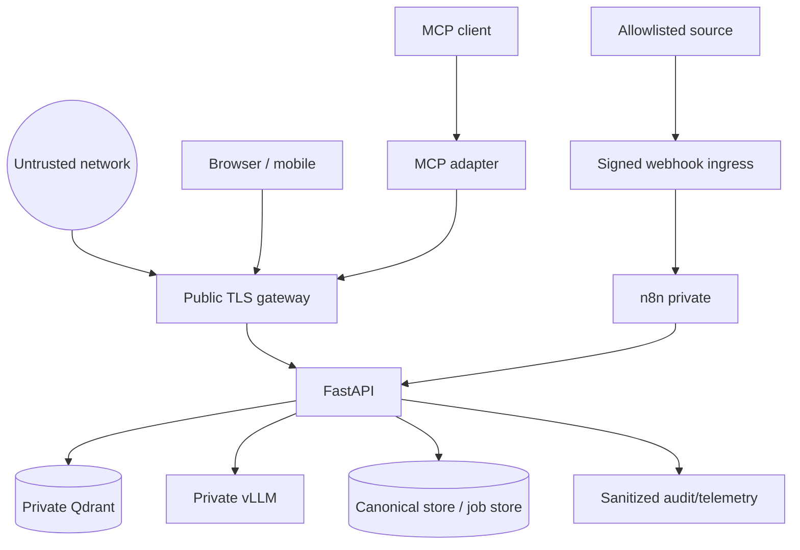

# Security and privacy review

Scope: FastAPI HTTP, browser/mobile clients, Qdrant, vLLM, n8n webhooks/jobs and MCP. This is a threat review and required control set, not proof that a production security assessment has passed.

## Trust boundaries

Only the gateway is public. Qdrant, vLLM, n8n UI/workers and internal command endpoints bind privately and use service authentication. Network location is defense in depth, not identity.

## Required controls

| Axis | Threat | Required control | Local evidence / gap |
| --- | --- | --- | --- |
| Bearer/OAuth | stolen/forged tokens, confused deputy | OIDC issuer/audience/expiry/signature validation; narrow scopes; short TTL; key rotation; separate service audience | FastAPI and Node OIDC/JWKS verifiers exist; live IdP and rotation unverified |
| CSRF/browser requests | cross-site state change | Prefer Authorization header rather than cookies; exact CORS allowlist; reject untrusted `Origin` on unsafe methods; if cookies are introduced, add CSRF token + SameSite policy | Bearer middleware and Origin check exist locally; gateway behavior unverified |
| CORS | hostile browser origin or credential leakage | Never wildcard with credentials; allow only required origins/methods/headers; validate preflight and reverse-proxy headers | Local FastAPI allowlist exists; production origins unknown |
| HTTP transport | interception, smuggling, redirect/token leak | TLS externally and private TLS/mTLS where required; fixed upstream URLs; no redirects for credentials; request/body limits; proxy normalization | vLLM adapter rejects public endpoint and redirects; end-to-end TLS unknown |
| SSRF | connector or model induces fetch | Dedicated allowlisted connectors; parse/resolve host; block loopback/link-local/metadata/private ranges as policy requires; pin redirect/DNS behavior; no generic fetch tool | vLLM URL fixed; source fetch boundary not implemented end to end |
| Webhooks | forgery/replay/body ambiguity | HMAC over timestamp + exact raw bytes; constant-time compare; five-minute window; durable unique event ID longer than retry; schema/body limit | Verification, replay SQLite and internal enqueue routes are wired locally; signature currently covers canonicalized parsed JSON, so the raw-body production gate remains no-go |
| Prompt injection | corpus tells model to ignore policy/exfiltrate | Treat task/context/tool text as data; delimit context; minimal system prompt; no tools for generator; validate JSON/citations; redact secrets before index | Prompt warns that chunks are untrusted; adversarial evaluation still required |
| Tenant isolation | cross-tenant vector/task leak | Derive identity from verified token; mandatory tenant + ACL filters; validate requested project; deny cross-tenant admin wildcard; negative tests and audit | Qdrant filter and request scope exist locally; real-db isolation tests required |
| Secrets/PII | leakage through corpus, logs, n8n executions, prompts | secret manager; data minimization; classification/redaction; encryption; retention/deletion; sanitized errors; no raw prompt/content logs by default | Config uses environment variables; secret manager/data policy/runtime review missing |
| Rate limits | cost/availability abuse | per-principal/tenant/IP budgets by endpoint; concurrent generation cap; request size limits; retry budget; 429/Retry-After | A local per-principal sliding-window limit protects the v2 AI routes; it is in-memory and not distributed |
| Audit log | repudiation or invisible sensitive reads | append-only events for auth decisions, corpus commands, reindex/alias, admin changes, MCP sensitive reads; actor/tenant/action/resource/outcome/correlation, never secrets/content | Hashed-subject audit events for v2/internal requests exist locally; a durable compliant audit sink/schema/retention is not implemented |

## Authentication and authorization contract

Required scopes include `ai:analyze`, `knowledge:read`, narrowly scoped ingestion commands and explicit admin operations. The token determines `tenant_id`, `user_id`, roles and allowed projects. Client headers/body fields may narrow this set but can never expand it. Static tokens are development-only unless an explicitly accepted single-tenant exception has high-entropy rotation and gateway protections.

OIDC/JWT verification must allowlist algorithms, require issuer/audience/subject/tenant/issued-at/expiry, cache JWKS safely, fail closed and bound network timeouts. Never accept identity from `X-Tenant-ID` unless a trusted gateway strips and re-signs it under a documented protocol.

## Browser, mobile and CSRF

With bearer tokens in the `Authorization` header and no ambient cookie credential, classic CSRF exposure is reduced, but malicious origins and token exfiltration still matter. Unsafe browser methods must validate `Origin`; missing Origin is acceptable only for authenticated non-browser clients under gateway policy. CORS is not authentication. Do not persist long-lived tokens in `localStorage`; use platform-secure storage/mobile keystore or a reviewed BFF/session design.

If browser auth later changes to cookies, this review must be reopened: use `Secure`, `HttpOnly`, restrictive `SameSite`, per-request CSRF protection for unsafe methods, and login/logout CSRF defenses.

## Webhook and job security

The local FastAPI integration authenticates internal calls with a dedicated service token, restricts it to configured tenant IDs, verifies timestamp/HMAC, atomically rejects replayed `event_id` values in SQLite, signs the validated internal dispatch and enqueues one of four allowlisted commands with `Idempotency-Key == event_id`. The local worker claims with expiring leases, reclaims crashed work, validates checksums/versions/ACL mapping, retries transient failures with bounded jitter and dead-letters permanent or exhausted work. This is integrated local code, not evidence that a worker is currently running. The present signature contract canonicalizes JSON; if a gateway signs transport bytes instead, migrate both ends together to exact raw-body verification and bind version/method/path. Retain replay records beyond maximum redelivery. Credential scope authorizes the tenant and operation; envelope fields only describe requested work.

Retry network/5xx failures with exponential backoff and jitter. Do not retry authentication, schema, ACL, checksum or permanent 4xx errors. Cap attempts and place exhausted work in a dead-letter state with sanitized alerts and manual replay authorization.

## Prompt/data exfiltration controls

- No secrets, raw credentials, private hidden prompts or unrestricted history in the corpus.
- Retrieved chunks are quoted as untrusted data; no instruction from a chunk changes system policy.
- The generation provider has no general HTTP, shell, database or n8n tool.
- Limit context chunks and bytes; escape/delimit IDs and content; require structured output.
- Accept only cited IDs returned by the current retriever and enforce ACL before generation.
- Golden attacks include “ignore previous instructions”, fake XML/JSON boundary closure, secret requests, cross-tenant references and citation fabrication.
- Responses must avoid revealing whether an inaccessible document exists.

## MCP-specific review

Local `stdio` minimizes network exposure. Remote HTTP requires the current MCP authorization specification, HTTPS, strict `Origin`, an audience-bound token, trusted gateway, private bind, connection/request limits and audit. Tool names are a static allowlist. Never expose arbitrary URL, command, workflow, database query, prompt, credential or filesystem tools. Upstream API tokens remain server configuration, not tool input/output.

## Security release gate

No-go for production until threat owners sign off the unresolved rows, secrets are externally managed, raw-body webhook verification is implemented, tenant-negative integration tests pass, rate limiting and audit storage exist, penetration testing covers HTTP/MCP/prompt injection, and incident/rotation/deletion runbooks are rehearsed.
