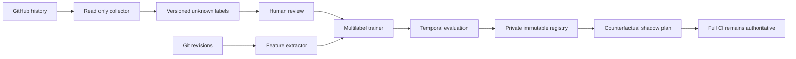

# CI impact classifier threat model

## Executive summary

The dominant risk is integrity loss: poisoned history, a drifted job universe or an invalid model
could incorrectly suggest that a required CI job is unnecessary. The design contains that risk by
keeping shadow output counterfactual, requiring an additive job union, separating CI-impact lineage
from the four-class MLOps registry, and converting every uncertain state into full CI.

## Scope and assumptions

- In scope: `backend-ai/app/ci_impact/`, `backend-ai/scripts/*ci_impact*`,
  `backend-ai/ci-impact/`, and their read-only interaction with GitHub history and Git.
- CI/build tooling is in scope; application runtime, end-user task data, deployment, `master` and
  production are out of scope.
- GitHub PR metadata, filenames, patches/check results and historical repository content are
  untrusted inputs. The local repository, trusted collection identity and private registry owner are
  assumed operator-controlled.
- Shadow evaluation does not control Actions job conditions. A later integration must preserve
  full-CI fallback and the independent `branch-policy` context.
- Open questions that would change ranking: who will perform/adjudicate labels, where a durable
  private registry will live, and which GitHub identity will own scheduled collection.

## System model

### Primary components

- The GitHub collector normalizes merged PRs, changed files, check-run observations and workflow
  identity into a versioned dataset (`backend-ai/scripts/collect_ci_impact_history.py`).
- Feature, model, evaluation and promotion modules produce checksum-bound local evidence
  (`backend-ai/app/ci_impact/`).
- The shadow CLI emits validated counterfactual JSON and has no workflow mutation interface
  (`backend-ai/scripts/run_ci_impact_shadow.py`).
- The private registry stores content-addressed candidate blobs without a promotion pointer
  (`backend-ai/app/ci_impact/artifacts.py`).

### Data flows and trust boundaries

- GitHub → collector: PR/file/check metadata over authenticated HTTPS; exact repo/base, bounded PR
  range, cumulative requests/bytes/records, pagination and subprocess timeout are enforced. Check
  results require the GitHub Actions app and a suite bound to the exact PR head; outcomes remain
  observations, never labels.
- Git history → dependency extractor: changes are derived from an ancestor base/head pair and both
  archived graphs are combined via argv-only subprocesses; process output, time,
  archive/file/total-byte/encoding/path limits apply and no member is extracted to the filesystem.
- Dataset → human review → trainer: labels cross the highest-integrity boundary; non-unknown labels
  require reviewer/evidence provenance and both classes per job before training.
- Trainer/evaluator → private registry: canonical JSON and SHA-256 references bind dataset, model,
  feature implementation/schema, job config, workflow, promotion policy, runtime, evaluation and
  a separately authenticated approval receipt; exclusive writes prevent replacement.
- Shadow CLI → CI consumer: allowlisted JSON only; no shell fragments or `GITHUB_OUTPUT`; full CI
  remains authoritative.
- Deterministic planner → adapter → shadow CLI: a versioned target-to-job mapping preserves the
  existing rule plan as an additive lower bound. The plan is mandatory and bound to resolved
  base/head SHAs, trusted event/ref context, exact canonical name-status changes and a recomputed
  digest. The canonical JavaScript resolver is rerun independently and its entire decision must
  match; missing/stale/foreign/narrowed plans, version drift, unknown targets and deterministic
  full-CI plans cannot be narrowed by the model.

#### Diagram

## Assets and security objectives

| Asset | Why it matters | Security objective (C/I/A) |
| --- | --- | --- |
| Canonical job universe and workflow | Missing one required check weakens delivery gates | I/A |
| Human labels and temporal split | Poisoning creates unsafe skip evidence | I |
| Model, schemas and thresholds | Drift changes decisions without review | I/A |
| Candidate/evaluation lineage | Must support reproducible promotion decisions | I |
| GitHub token and private registry | Grants metadata access and stores sensitive lineage | C/I |
| Full-CI fallback | Preserves repository safety during uncertainty | A/I |

## Attacker model

### Capabilities

- A PR author can choose unusual paths, renames, binary files, imports and large changes.
- A compromised or mistaken reviewer can supply an incorrect counterfactual label.
- A process with registry write access can attempt artifact replacement or mismatched lineage.
- External API failures can truncate or stale the history snapshot.

### Non-capabilities

- A normal PR author is not assumed to control the trusted collector token, protected branch rules or
  private registry owner.
- The shadow CLI cannot mutate a workflow or deploy code.
- SHA-256 integrity does not authenticate a malicious actor who already controls every registry
  input; access control and review remain external requirements.
- Reviewer IDs, free-text evidence, dataset receipts, SHA-256 and `O_EXCL` do not authenticate the
  writer. Schema-valid poisoned labels remain possible until a future approved reviewer allowlist
  and authenticated dual-review/adjudication attestation are bound to the exact dataset checksum.

## Entry points and attack surfaces

| Surface | How reached | Trust boundary | Notes | Evidence |
| --- | --- | --- | --- | --- |
| GitHub API payload | Collector CLI | Network → trusted collector | Bounded, schema-normalized, labels stay unknown | `backend-ai/scripts/collect_ci_impact_history.py` |
| Historical source archive | Full Git SHA | Git object store → parser | No shell/eval or filesystem extraction | `backend-ai/app/ci_impact/features.py` |
| Manual labels | Dataset edit/review | Human → trainer | Required provenance and both classes | `backend-ai/app/ci_impact/models.py` |
| Model/config JSON | Shadow CLI args | Filesystem → planner | Strict Pydantic schemas and checksums | `backend-ai/scripts/run_ci_impact_shadow.py` |
| Registry blobs | Candidate training | Trainer → private storage | Content addressed, private, exclusive | `backend-ai/app/ci_impact/artifacts.py` |
| Counterfactual plan | JSON output | Planner → versioned adapter → future CI integration | Allowlisted jobs; deterministic union; no skip authority | `backend-ai/app/ci_impact/shadow.py` |

## Top abuse paths

1. A green job is mislabeled safe-to-skip → model learns a false negative → future integration omits
   protection. Control: green remains unknown and promotion requires reviewed support/zero unsafe
   skips.
2. A PR introduces a novel top-level path or dynamic import → path rules miss a consumer → model
   overconfidently narrows jobs. Control: unknown/unresolved/OOD causes abstain/full CI.
3. Workflow/job names change without config update → probabilities refer to stale jobs → required
   context disappears. Control: checksum/job-universe mismatch blocks and full CI remains canonical.
4. A registry blob, policy, approval or manifest is replaced → shadow loads unrelated evidence.
   Control: content-addressing, exclusive writes and load-time semantic/checksum verification;
   trainer self-assertion cannot satisfy the external approval gate.
5. A crafted archive path, binary or huge history response exhausts/parses outside scope. Control:
   full SHA, path checks, no extraction, count/byte/time limits and failure-to-full-CI.
6. A future workflow interpolates untrusted filenames/model text into shell outputs → command/output
   injection. Control: this package emits schema-validated JSON and the integration must consume only
   canonical job enums.

## Threat model table

| Threat ID | Threat source | Prerequisites | Threat action | Impact | Impacted assets | Existing controls (evidence) | Gaps | Recommended mitigations | Detection ideas | Likelihood | Impact severity | Priority |
| --- | --- | --- | --- | --- | --- | --- | --- | --- | --- | --- | --- | --- |
| TM-001 | Bad/mistaken labeler | Dataset write/review access | Marks green observation safe-to-skip without causal proof | Unsafe CI omission | Labels, model, gates | Unknown-by-default, provenance shape validation and unavailable trusted approval verifier (`history.py`, `models.py`, `promotion.py`) | Reviewer/evidence fields and receipt checksums do not authenticate writers | Approved reviewer allowlist plus authenticated dual review/adjudication bound to the exact dataset checksum | Label conflict/unknown/support report | medium | high | high |
| TM-002 | PR author or repo drift | Novel path/import/job | Produces OOD change that maps to too few jobs | Missed regression/security check | Job universe, fallback | Unknown/workflow/manifest/lockfile abstention (`shadow.py`) | Dynamic import completeness is limited | Verify config against workflow/bridge checksums before every run | Abstention and unknown-path trend | medium | high | high |
| TM-003 | Registry writer | Write access | Mixes or replaces model/evaluation/policy/approval lineage | False promotion evidence | Candidate lineage | Content addressing, `O_EXCL`, semantic and checksum verification (`artifacts.py`, `promotion.py`) | SHA alone does not authenticate owner | Protected storage, authenticated approval receipts, independent verifier | Registry conflict/tamper alerts | low | high | medium |
| TM-004 | Crafted Git/history input | PR creation | Uses path/archive/resource edge cases | DoS or parser confusion | Evaluator availability | No shell, no extraction, full SHA and limits (`features.py`) | API retry/rate-limit policy is basic | Add bounded retries, Unicode normalization policy and archive streaming cap | Collection failure/limit counters | medium | medium | medium |
| TM-005 | Future integrator | Workflow edit access | Treats shadow list as subtractive skip authority | Full-CI safety boundary lost | Full-CI fallback | Current CLI has no mutation interface; docs require union | Workflow integration not implemented | Separate reviewed task; invariant test against canonical contexts | Alert on skipped/missing required contexts | low | high | medium |
| TM-006 | Output consumer | Future CI read access | Interpolates untrusted values into shell/output channels | Injection or job selection drift | CI runner, plan | Canonical job enum and JSON output (`models.py`) | Consumer does not yet exist | Parse JSON with schema; never emit paths to shell/GITHUB_OUTPUT | Reject non-enum plan fields | low | high | medium |

## Criticality calibration

- Critical: an implemented path that silently skips a required protected check, executes PR code with
  a privileged token, or permits registry-to-workflow code execution. None is currently present.
- High: poisoned labels or job-universe drift capable of suggesting unsafe omissions; unauthorized
  model/config replacement before future integration.
- Medium: bounded collection/parser denial of service, tamper attempts caught by checksums, or output
  misuse requiring a separately authorized workflow change.
- Low: local-only malformed development fixtures or noisy abstention that merely runs more CI.

## Focus paths for security review

| Path | Why it matters | Related Threat IDs |
| --- | --- | --- |
| `backend-ai/app/ci_impact/shadow.py` | Owns the full-CI fail-safe and additive plan | TM-002, TM-005 |
| `backend-ai/app/ci_impact/models.py` | Enforces trusted paths, jobs, labels and output schemas | TM-001, TM-006 |
| `backend-ai/app/ci_impact/features.py` | Parses historical untrusted source/archive structure | TM-002, TM-004 |
| `backend-ai/app/ci_impact/artifacts.py` | Protects immutable model/evaluation lineage | TM-003 |
| `backend-ai/app/ci_impact/promotion.py` | Encodes zero-unsafe-skip and evidence gates | TM-001, TM-002 |
| `backend-ai/scripts/collect_ci_impact_history.py` | Crosses the GitHub network trust boundary | TM-001, TM-004 |
| `backend-ai/scripts/train_ci_impact_candidate.py` | Composes temporal data, model, metrics and registry | TM-001, TM-003 |
| `.github/workflows/ci.yml` | Future integration target; unchanged in this slice | TM-002, TM-005, TM-006 |
| `.github/scripts/bridge-sync-pr-statuses.mjs` | Independent canonical required-context source | TM-002, TM-005 |

## Quality check

- Covered GitHub, Git archive, manual labels, model/config, registry and JSON output entry points.
- Covered every identified trust boundary and separated CI/dev tooling from application runtime.
- Reflected the provided constraints: shadow only, no workflow integration, no merge/deploy/production,
  no fabricated labels or quality.
- Remaining owner/reviewer/registry questions are explicit and keep promotion closed.
